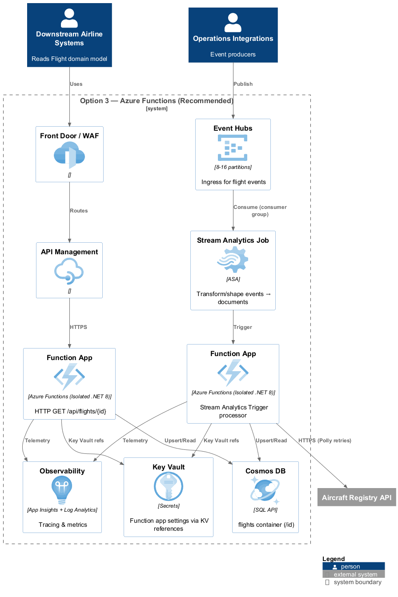

# Flight Tracking System Architecture Analysis

## Solution Options Analysis

Here is an analysis of the four proposed solutions, with pros and cons for each.

### Option 1. Azure Stream Analytics + Database + Azure Functions

*   **Description:** This solution uses Azure Stream Analytics to process messages from the Event Hub, storing the results in a database. An Azure Function app would query the database to provide the flight lookup service.
*   **Pros:**
    *   **Serverless:** Stream Analytics is a fully managed service, requiring no infrastructure management for the message processing part.
    *   **High Throughput:** Designed for real-time processing of large volumes of data.
    *   **Rapid Development:** The SQL-like query language can be fast for setting up simple data flows.
*   **Cons:**
    *   **External Service Calls:** Stream Analytics has very limited capabilities for calling external services. The requirement to call a REST service for each `FLIGHT` message makes Stream Analytics a poor choice. This is the biggest drawback of this option.
    *   **Complex Logic:** Implementing complex business logic, state management, and error handling is difficult and cumbersome in the Stream Analytics query language.
    *   **Vendor lock-in:**: Heavily dependent on Azure-specific services
    *   **Testing:** Local development and testing of Stream Analytics jobs is not as straightforward as with application code.

#### Architecture Diagram

### Option 2. Create a .Net Core app for message processing and hosting the flight lookup service

*   **Description:** A single .NET Core application would be responsible for both reading messages from the Event Hub and providing the API endpoint. This would be hosted on Azure App Services.
*   **Pros:**
    *   **Flexibility and Control:** Provides complete control over the code, making it easy to implement complex logic and call external services.
    *   **Unified Solution:** A single codebase and deployment can simplify development and management.
    *   **Testability:** The application can be easily unit and integration tested.
*   **Cons:**
    *   **Infrastructure Management:** Requires managing the App Service plan, including scaling and deployments.
    *   **Coupling:** The message processing and API are in the same application. If their scaling needs are different (e.g., message processing is CPU-intensive, API is memory-intensive), it can be inefficient to scale them together.
    *   **HA:** While App Services can be deployed in a highly available way, it requires more configuration and management than serverless options.

#### Architecture Diagram

### Option 3. A combination of 1 and 2

*   **Description:** This option uses Stream Analytics for message processing and a .NET Core Azure Function service for the flight lookup service.
*   **Pros**
    *   **Separation of concerns:** Processing and API can scale independently
    *   **Specialized optimization:** Each component optimized for its specific role
    *   **Fault isolation:** API remains available even if message processing has issues
    *   **Independent deployment:** Can update API without affecting message processing
*   **Cons:**
    *   **Separation of concerns:** Processing and API can scale independently
    *   **Specialized optimization:** Each component optimized for its specific role
    *   **Fault isolation:** API remains available even if message processing has issues
    *   **Independent deployment:** Can update API without affecting message processing

#### Architecture Diagram

### Option 4: Event-Driven Microservices (Recommended)
*   **Pros**
    *   **True high availability:** Independent scaling and failover for each service
    *   **Performance optimization:** Dedicated caching and database read replicas
    *   **Technology flexibility:** Can use different technologies for different services
    *   **Fault isolation:** Failure in one service doesn't affect others
    *   **Observability:** Clear service boundaries for monitoring and alerting
*   **Cons**
    *   **Higher complexity:** More services to manage and orchestrate
    *   **Network overhead:** Inter-service communication latency
    *   **Data consistency:** Eventual consistency challenges across services
    *   **Operational overhead:** Multiple deployment pipelines and monitoring systems

#### Architecture Diagram

### Comparison Matrix

| Criteria             | Option 1 | Option 2 | Option 3 | Option 4  |
|----------------------|----------|----------|----------|-----------|
| Availability         | High     | Medium   | High     | Very High |
| Scalability          | High     | Medium   | High     | Very High |
| Complexity           | Medium   | Low      | Medium   | High      |
| Cost                 | Low      | Medium   | Medium   | High      |
| Performance          | Good     | Good     | Good     | Excellent |
| Flexibility          | Low      | Medium   | Medium   | High      |
| Operational Overhead | Low      | Medium   | Medium   | High      |

### Final Recommendation: Option 4 (Event-Driven Microservices)
Given the high availability requirements and the need for scalability at an airline level, Option 4 provides the best long-term solution despite higher initial complexity.
