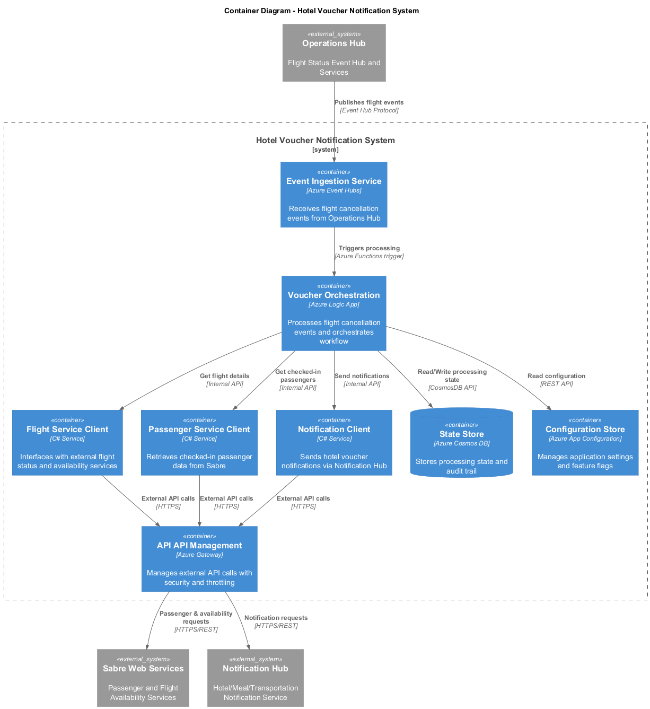

Here is the comprehensive C4 diagram set for the Hotel Voucher Notification System. 
### 1. Context Diagram
Shows the high-level system context with external actors and systems:

-  Gate Agents using Gate Applications
- Passengers receiving notifications
- External systems (Operations Hub, Notification Hub, Sabre Services)

#### 2. Container Diagram
Details the internal architecture of the notification system:

- Event Ingestion Service: Receives events from Operations Hub
- Voucher Orchestration: Core workflow engine
- Flight Service Client: Checks flight availability and passenger eligibility
- Passenger Service Client: Retrieves checked-in passenger data from Sabre
- Notification Client : Sends hotel voucher notifications via Notification Hub
- Supporting services: Event Bus, Cosmos DB, Key Vault, Configuration Store

### 3. Component Diagram
Breaks down the Notification Orchestrator into specific components:

- Voucher Orchestrator
- Status Checker
- Availability Checker
- Passenger Fetcher
- Notifier

### 4. Deployment Diagram
Shows the Azure infrastructure with security and networking:

Network Security: WAF, Private endpoints, Network Security Groups
Compute: Functions in dedicated subnets
Data: Cosmos DB and Service Bus with private connectivity
Security: Key Vault, Azure AD, Security Center, Sentinel
Monitoring: Application Insights and Log Analytics

### 5. Sequence Diagram
Illustrates the complete workflow from flight cancellation to passenger notification, including:

Event processing and validation
Flight availability checking
Passenger retrieval and notification
Error handling and retry logic

### Key Design Principles Implemented:
#### Security:
Private endpoints for all data services
WAF protection for external traffic
Managed identities for service authentication
Network segmentation with NSGs

#### Reliability:
Event-driven architecture with Service Bus
Retry mechanisms for failed notifications
Comprehensive audit logging
Multi-zone deployment for high availability

#### Scalability:
Serverless Functions that auto-scale
Service Bus for reliable message processing
Cosmos DB for global distribution